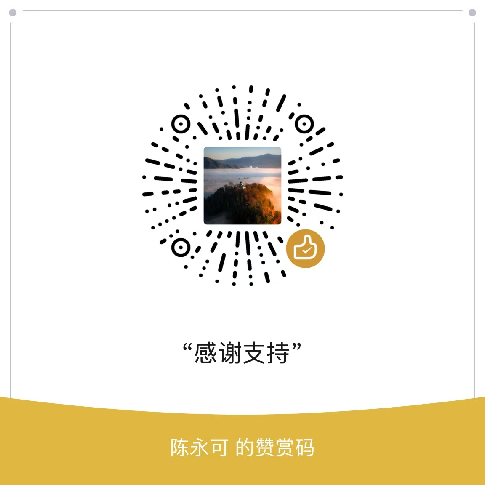

# AI Book Manager — Obsidian Book Library Plugin

[](https://github.com/cyk111/ai-book-manager/releases)
[](https://github.com/cyk111/ai-book-manager/actions)
[](LICENSE)
[](https://obsidian.md)

> 🤖 AI-powered book library manager for Obsidian — scan local books, auto-classify with AI tags, build knowledge graphs, and compile books into reusable AI skills. Turn every book into your second brain.

> 中文文档请往下滚动 | Chinese documentation below
>
> AI 驱动的 Obsidian 图书管理插件 —— 扫描本地书籍、自动 AI 分类打标、生成知识图谱、一键编译 AI Skill。

## What is AI Book Manager?

AI Book Manager scans your local book directory (PDF, EPUB, TXT), uses AI to automatically classify and tag each book, generates structured Markdown notes with wikilinks, and builds a knowledge graph in Obsidian. It also integrates reading notes from WeChat Read and Apple Books, and can compile any book into a reusable AI skill for Claude Code, Codex, Cursor, and Copilot CLI.

### Key Features

- 📂 **Multi-format book scanning** — PDF, EPUB, TXT with recursive directory walking and SHA256 dedup
- 🏷️ **AI auto-classification** — DeepSeek, OpenAI, or Qwen generate 3 tags + 1 category per book
- 📚 **Multi-source integration** — WeChat Read and Apple Books highlight notes as index cards with cross-referencing
- 🧠 **One-click AI Skill generation** — Compile books into structured skills for Claude Code, Codex, Cursor, Copilot CLI
- 🗺️ **Knowledge graph** — Obsidian native graph + wikilinks show book connections
- ⚡ **Lazy AI** — Summaries, TOC, and chapter analysis generated on demand to save tokens
- 🔄 **Hybrid sync** — Optional auto-sync on startup + real-time file watching
- 🌐 **Multi-model support** — OpenAI, DeepSeek, Qwen, or any OpenAI-compatible API

---

# 中文文档

## AI Book Manager — Obsidian 智能图书管理插件

## 📖 目录

- [功能特性](#-功能特性)
- [安装](#-安装)
- [快速开始](#-快速开始)
- [配置说明](#-配置说明)
- [功能详解](#-功能详解)
  - [书籍扫描与解析](#书籍扫描与解析)
  - [AI 自动分类打标](#ai-自动分类打标)
  - [微信读书 & Apple Books 集成](#微信读书--apple-books-集成)
  - [一键生成 AI Skill](#一键生成-ai-skill)
  - [知识图谱](#知识图谱)
- [支持的 AI 模型](#-支持的-ai-模型)
- [开发](#-开发)
- [常见问题](#-常见问题)
- [致谢](#-致谢)
- [支持作者](#-支持作者)
- [许可证](#-许可证)

---

## ✨ 功能特性

- 📂 **多格式书籍扫描** — 支持 PDF、EPUB、TXT，递归扫描整个目录
- 📝 **智能文本解析** — 自动提取书籍元数据（标题、作者、正文预览）
- 🏷️ **AI 自动分类打标** — DeepSeek / OpenAI / 通义千问，自动生成标签和分类
- 📚 **多源笔记集成** — 支持微信读书、Apple Books 划线笔记，生成索引卡片，交叉引用
- 🧠 **一键编译 AI Skill** — 将书籍蒸馏为结构化 Skill 文件，同步到 Claude Code / Codex / Cursor / Copilot CLI
- 🗺️ **知识图谱** — 利用 Obsidian 原生图谱 + wikilinks 展示书籍关联
- ⚡ **懒加载 AI** — 简介、目录、章节概要按需生成，不浪费 Token
- 🔄 **混合同步策略** — 启动自动增量扫描 + 实时文件监听（需手动开启）
- 🌐 **多模型支持** — OpenAI、DeepSeek、通义千问，OpenAI 兼容 API 均可使用

---

## 📦 安装

### 方式一：Obsidian 社区插件市场（推荐）

1. 打开 Obsidian → 设置 → 第三方插件 → 关闭安全模式
2. 点击「浏览」，搜索 **AI Book Manager**
3. 安装并启用

### 方式二：BRAT 插件（Beta 测试）

1. 安装 [BRAT](https://github.com/TfTHacker/obsidian42-brat) 插件
2. BRAT 设置 → Add Beta Plugin → 输入 `cyk111/ai-book-manager`
3. 启用插件

### 方式三：手动安装

1. 从 [Releases](https://github.com/cyk111/ai-book-manager/releases) 下载最新版
2. 解压到 `<vault>/.obsidian/plugins/ai-book-manager/`
3. 重启 Obsidian，在设置中启用

---

## 🚀 快速开始

1. **配置书籍目录** — 设置你存放电子书的文件夹绝对路径
2. **配置 AI API Key** — 填入 DeepSeek / OpenAI / 通义千问的 API Key（配置后自动启用 AI 打标）
3. **扫描书籍** — `Cmd/Ctrl+P` → `Scan book directory`
4. **查看结果** — 打开 `📚图书库/本地書籍/`，浏览生成的书籍笔记
5. **使用 AI 功能** — 在笔记中点击「生成简介」「生成目录」「生成 Skill」

---

## ⚙️ 配置说明

| 设置项 | 说明 | 默认值 |
|--------|------|--------|
| Book directory | 书籍文件夹绝对路径 | 无 |
| Supported formats | 扫描的文件后缀 | `.pdf,.epub,.txt` |
| AI 模型 | AI 服务提供商 | DeepSeek |
| API Key | AI 服务的 API 密钥 | 无 |
| API URL | API 端点地址 | 自动填充 |
| Model | 模型名称 | 自动填充 |
| Auto AI tagging | 扫描后自动 AI 分类打标 | 关（配 Key 后自动开启） |
| Notes folder | 生成的笔记存放目录 | `📚图书库` |
| Max scan pages | AI 分类读取的前 N 页 | 3 |
| Max concurrency | 并发 AI 请求数 | 1 |
| 启用自动同步 | 启动时自动增量扫描（需配置书籍目录） | 关 |
| 实时监听文件变更 | 文件变化时自动同步新书 | 关 |
| 笔记来源 | 微信读书 / iBook 等笔记目录 | 无 |
| Skill 生成模式 | 轻量（仅章节）/ 完整（含术语表等） | 轻量 |
| 同步到 AI 工具 | Skill 软链接同步目标 | 无 |

---

## 📖 功能详解

### 书籍扫描与解析

支持 PDF、EPUB、TXT 三种格式，通过 SHA256 哈希去重，避免重复扫描。扫描版 PDF 会自动检测并跳过（无文字层）。

扫描后的目录结构：

```
📚图书库/
├── 本地書籍/
│   ├── 科幻/
│   │   ├── 科幻.md          ← 分类导航页
│   │   └── 三体.md          ← 书籍笔记
│   └── 编程/
│       ├── 编程.md
│       └── 重构.md
├── 微信读书/
│   └── 推理悬疑/
│       └── 嫌疑人X的献身.md   ← 索引卡片
└── Skills/
    └── 三体-abc123/
        ├── SKILL.md
        └── chapters/
```

### AI 自动分类打标

启用后，扫描完成的书籍自动排队调用 AI 分类。每次分类只发送书名 + 前 3 页内容（约 500 字符），最大限度节省 Token。

每个书籍生成 3 个中文标签 + 1 个分类（从 25 个预设分类中选择），写入 Markdown 的 YAML frontmatter：

```yaml
---
title: "三体"
author: "刘慈欣"
tags: ["科幻", "物理学", "文明"]
category: "科幻"
---
```

### 微信读书 & Apple Books 集成

配置笔记来源目录后，插件自动扫描微信读书、Apple Books 导出的 Markdown 笔记，为每本书创建索引卡片，并自动进行跨来源交叉引用匹配（ISBN → 标题+作者 → 仅标题）。

- 索引卡片包含指向原始笔记的 wikilink
- 自动寻找不同来源的同一本书并关联
- 低置信度匹配标记 ⚠️ 待确认

### 一键生成 AI Skill

将书籍编译为通用 AI Skill（Markdown 格式），存放在 Vault 内 `📚图书库/Skills/` 下。通过软链接同步到 Claude Code、Codex、Cursor、Copilot CLI 等 AI 工具。

**生成流程**：提取全文 → 分析章节结构 → 生成章节概要 → 合成 SKILL.md → 创建软链接

```
Skill 目录结构：
三体-abc123/
├── SKILL.md              ← 核心思维模型 + 章节索引
├── chapters/
│   ├── ch01-*.md         ← 每章独立概要
│   └── ...
├── glossary.md           ← 术语表（完整模式）
├── patterns.md           ← 模式库（完整模式）
└── cheatsheet.md         ← 速查表（完整模式）
```

### 知识图谱

所有书籍标签、分类、交叉引用都通过 Obsidian 的 wikilinks 连接，在原生图谱视图中自动呈现书籍关联网络。

---

## 🌐 支持的 AI 模型

| 提供商 | 模型 | 说明 |
|--------|------|------|
| DeepSeek | deepseek-chat | 默认，性价比最高 |
| OpenAI | gpt-4o / gpt-4o-mini | 兼容性最好 |
| 通义千问 | qwen-plus / qwen-max | 阿里云 |
| 其他 | 任意 OpenAI 兼容 API | 自定义 Base URL |

**Token 消耗参考**（DeepSeek 定价）：

| 操作 | 输入 | 输出 | 预估费用 |
|------|------|------|---------|
| AI 打标 | 500 chars | 200 tokens | ~0.00035 元 |
| 生成简介 | 3000 chars | 400 tokens | ~0.0012 元 |
| 生成目录 | 5000 chars | 800 tokens | ~0.0021 元 |
| 章节概要 | 10000 chars | 1200 tokens | ~0.0038 元 |
| Skill 生成（12 章） | — | — | ~0.03 元 |

---

## 🔧 开发

```bash
# 安装依赖
npm install

# 构建
npm run build

# 监听模式（开发时使用）
npm run dev

# 类型检查
npx tsc --noEmit

# 运行测试
npm test

# 测试覆盖率
npm test -- --coverage
```

### 技术栈

- **平台**: Obsidian Plugin API（TypeScript）
- **构建**: esbuild
- **测试**: Jest (205 tests)
- **PDF 解析**: pdfjs-dist
- **EPUB 解析**: adm-zip
- **AI**: OpenAI 兼容 API（DeepSeek / OpenAI / 千问）

### 项目结构

```
├── main.ts                    # 插件入口
├── src/
│   ├── models.ts              # 类型定义
│   ├── ai-client.ts           # AI API 客户端
│   ├── parser.ts              # 书籍解析器
│   ├── scanner.ts             # 文件扫描器
│   ├── services/
│   │   ├── scan-service.ts    # 扫描编排
│   │   ├── tag-service.ts     # AI 打标
│   │   ├── note-service.ts    # 笔记 CRUD
│   │   ├── skill-service.ts   # Skill 生成流水线
│   │   ├── source-scanner.ts  # 笔记来源扫描
│   │   ├── file-watcher.ts    # 文件监听
│   │   └── queue-service.ts   # 任务队列
│   ├── views/
│   │   ├── sidebar-view.ts    # 侧边栏
│   │   └── setting-tab.ts     # 设置页
│   └── __tests__/             # 测试文件
├── manifest.json
├── LICENSE
└── README.md
```

---

## ❓ 常见问题

### Q: 扫描后没有生成笔记？

- 检查书籍目录是否填写了绝对路径（非相对路径）
- macOS：Obsidian 首次访问文件目录时会弹窗请求权限，必须点「允许」
- 只支持 `.pdf`、`.epub`、`.txt` 格式

### Q: 扫描版 PDF 无法提取文字怎么办？

插件会自动检测并跳过无文字层的 PDF，书籍仍会创建笔记，但 AI 打标时只依赖文件名，标签质量会下降。

### Q: AI 会不会编造书里没有的内容？

不会。所有 AI 提示词都包含严格限定：「只能基于提供的书籍内容进行提炼，绝不编造任何信息。如果内容中没有相关信息，请明确说明。」

### Q: 为什么不支持移动端？

插件使用 Node.js `fs` 模块监听文件变化和读取本地文件系统，这些 API 在 Obsidian 移动端不可用。

### Q: 如何更新已扫描的书籍？

重新扫描即可。插件通过 SHA256 哈希去重，只会处理新增或修改的文件。如果修改了已有书籍的文件名，需要删除原笔记再重新扫描。

---

## 🙏 致谢

### 灵感来源

- [book-to-skill](https://github.com/virgiliojr94/book-to-skill) — 将书籍编译为 AI Skill 的核心设计理念
- [Obsidian Weread Plugin](https://github.com/zhaohongxuan/obsidian-weread-plugin) — 微信读书集成参考
- [obsidian-ibook-plugin](https://github.com/bingryan/obsidian-ibook-plugin) — Apple Books 高亮同步参考

### 核心依赖

- [pdfjs-dist](https://github.com/mozilla/pdf.js) — PDF 文本提取引擎
- [adm-zip](https://github.com/cthackers/adm-zip) — EPUB 文件解析
- [Obsidian API](https://docs.obsidian.md) — 插件开发平台

### 贡献者

感谢所有参与测试、反馈 bug 和提出建议的用户。你们的帮助让这个项目变得更好。

---

## ☕ 支持作者

如果这个插件对你有帮助，欢迎请我喝杯咖啡 ☕



也欢迎在 GitHub 上给项目点个 ⭐ Star！

---

## 📜 许可证

本项目采用 **Creative Commons Attribution-NonCommercial 4.0 International (CC BY-NC 4.0)** 协议。

- ✅ **允许**：个人学习、研究、非商业用途的自由使用、修改、分发
- ❌ **禁止**：未经授权的商业用途
- 📧 **商业授权**：如需商业使用，请联系作者获取授权

完整协议文本见 [LICENSE](LICENSE) 文件。

Copyright (c) 2024 cyk111

---

[⬆ 回到顶部](#ai-book-manager--obsidian-智能图书管理插件)
